[Marketplace](https://www.unrealengine.com/marketplace/en-US/product/horizon-quest-general-purpose-quest-graph-system) 

[](https://dev.azure.com/hsgame/UEHorizonPlugin/_build/latest?definitionId=54&repoName=HorizonQuestDemo&branchName=main)

public feed: nuget.org  

[](https://www.nuget.org/packages/HorizonQuestDemo/)
  


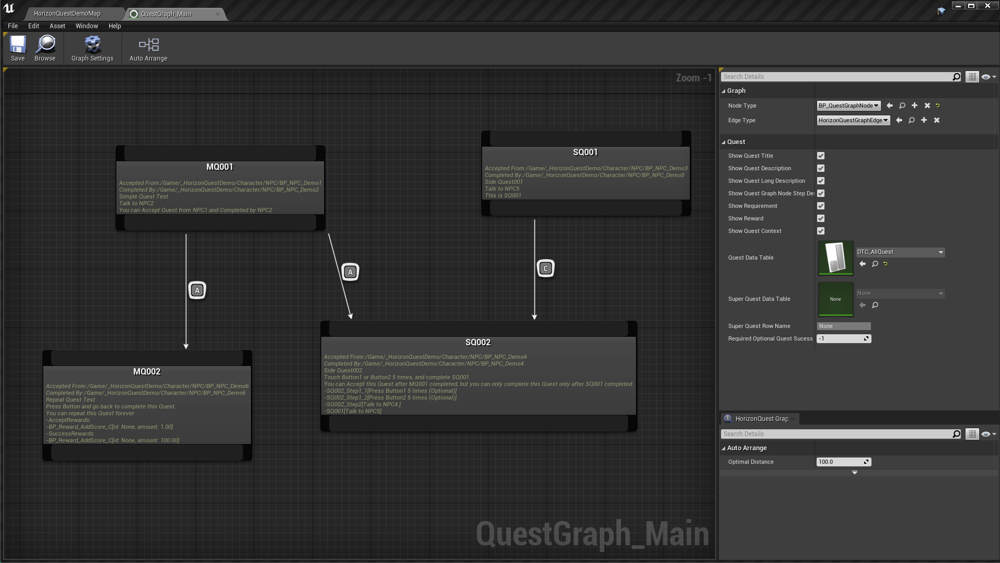  


Note: 

main branch may be unstable since it is in development, please switch to tags, for example: editor/4.27.0.1

  

How to Run Demo Project before purchase:(Only for Win64 editor build, no source code)
1. Double click install_game_package_from_nuget_org.cmd or install_game_package_from_nuget_org.sh, and check if Unrealditor-*.dll are installed to Binaries\Win64 and Plugins\HorizonQuest\Binaries\Win64\
2. Double click HorizonQuestDemo.uproject  


----------------------------------------------
               HorizonQuestDemo
                 5.4.0
          	dorgonman@hotmail.com
----------------------------------------------
   
-----------------------
System Requirements
-----------------------

Supported UnrealEngine version: 4.27-5.4
 

-----------------------
Installation Guide
-----------------------

If you want to use plugins in C++, you should add associated module to your project's 
YOUR_PROJECT.Build.cs:
PublicDependencyModuleNames.AddRange(new string[] { "HorizonQuest", "HorizonQuestFlag" });

-----------------------
User Guide: Quick Start
-----------------------

1. Create DataTable with FHorizonQuestTableRow and Add Quest to it.

  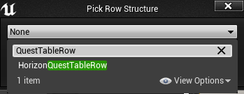  

  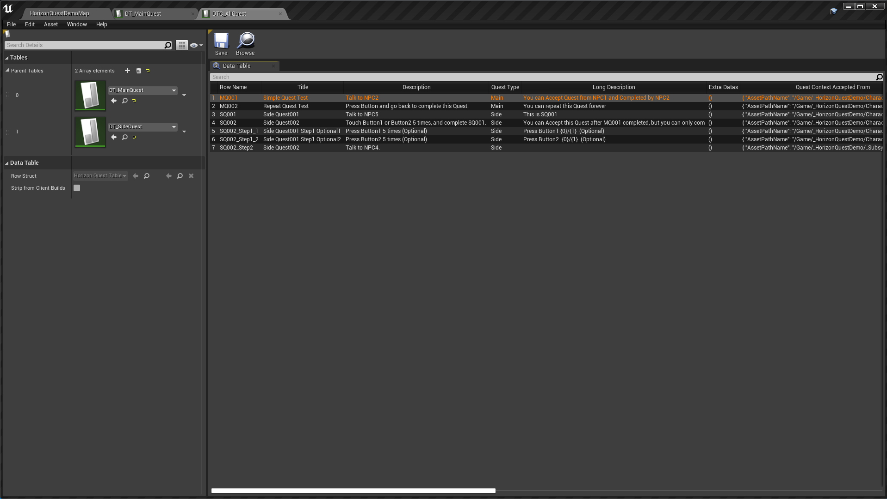 

2. Create QuestGraph and Design Quest Dependency.

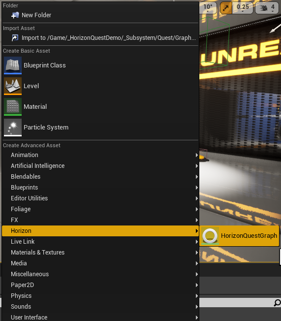  

  

You can have two types of QuestDependency: Accept(Ⓐ Icon) and Complete(Ⓒ Icon). 

+ Accept(Ⓐ) Dependency: means you can "Accept" the Quest only after it's Parent Quest is Completed. 

	Following image shows a possible use case that you will want to use Accept Dependency, check folling path to see how to implement it: /Game/_HorizonQuestUseCase/DragonQuest/QuestGraph/QuestGraph_DragonQuest:

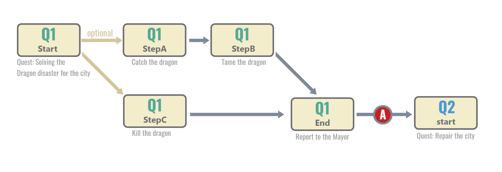  
	

+ Complete(Ⓒ) Dependency: means you can "Complete" the Quest only after it's Parent Quest is Completed.

	Following image shows a possible use case that you will want to use Complete Dependency, check folling path to see how to implement it: /Game/_HorizonQuestUseCase/CookMushroom/QuestGraph/QuestGraph_CookMushroom:

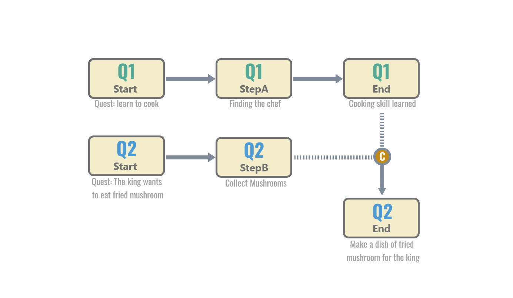  


+ No Dependency: You can accept and complete the quests without dependency check..


3. Add HorizonQuestManager and HorizonQuestFlagManager Component to your PlayerState.

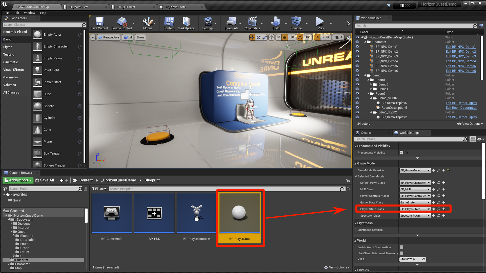  

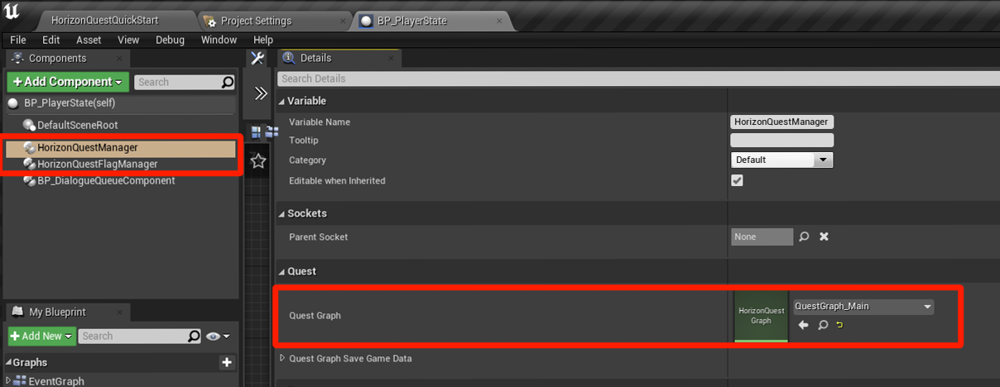  

4. Then you can Accept/Complete Quest or Add QuestFlag using managers.

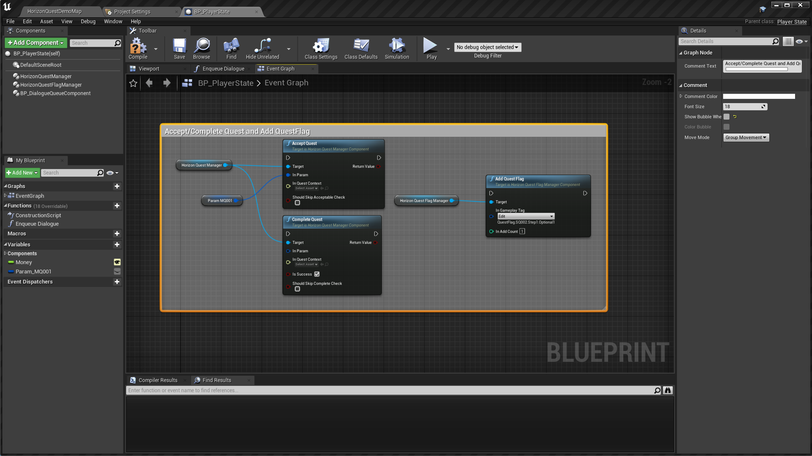  


Following screenshot is some Functions in QuestManagers.

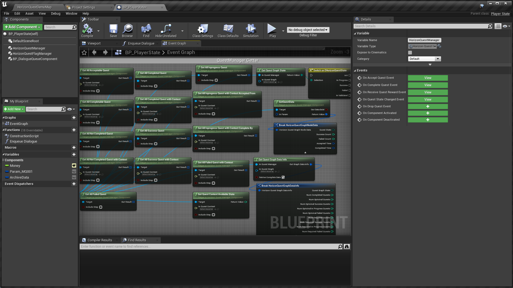  
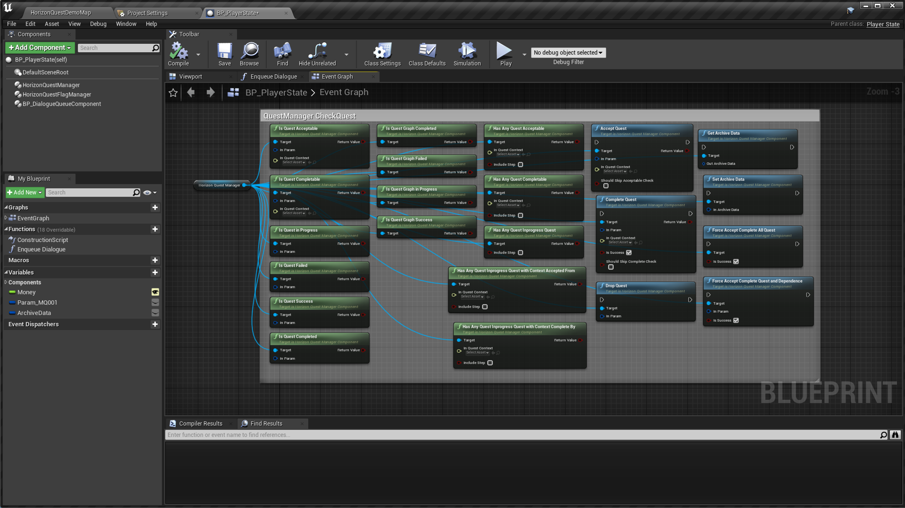  


Following screenshot is some Functions in QuestFlagManagers.

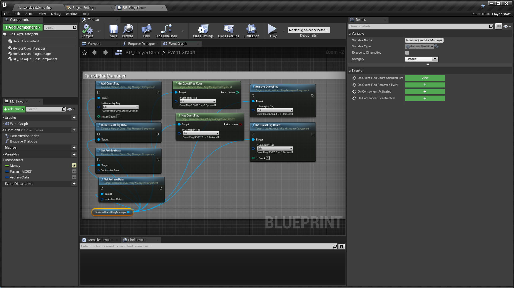  


-----------------------
User Guide: Quest Widgets
-----------------------

This plugin implement some C++ Widgets that can help show player's quest progression in UI. 

You may want to check demo project first to see how to implement those Widget as WBP and adjust it layouts:
/Game/_HorizonQuestDemo/_Subsystem/Quest/UI/Widget/WBP_QuestMenu.WBP_QuestMenu

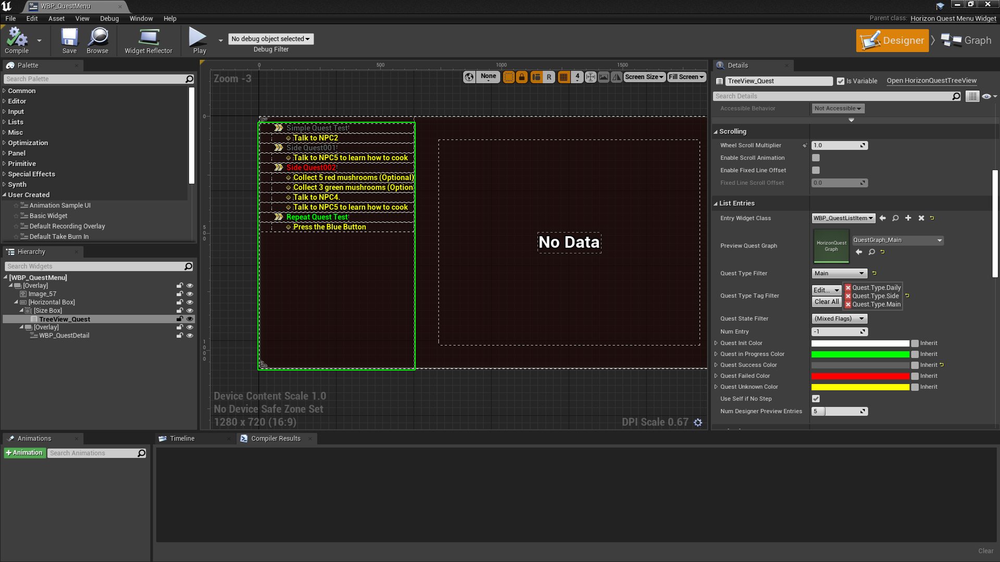  

1. HorizonQuestMenuWidget is most import part of Quest UI, it put HorizonQuestTreeView and HorizonQuestDetailWidget together and display of those widgets. 

2. HorizonQuestTreeView implment [UTreeView](https://docs.unrealengine.com/4.27/en-US/BlueprintAPI/TreeView/) come from UMG that can display all Quest and QuestStep in single Widget. This widget should be used together with HorizonQuestListIItemWidget(or it inheritance class), which implement IUserObjectListEntry for TreeView and QuestInfo UI Synchronization.

3. HorizonQuestDetailWidget is the Widget that can display single QuestInfo come from QuestGraph and QuestDataTable.

There are some other useful Widget provided in the plugin:

4. HorizonQuestDebugTileView/HorizonQuestDebugListIItemWidget: Used for list all Quests in QuestGraph and and Trigger the Quest which click. 
   You can check current support Trigger type in following screenshot.

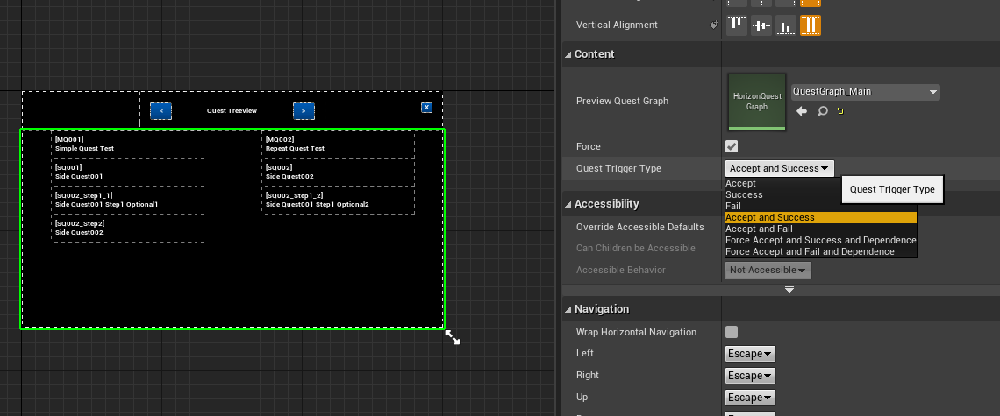  


5. HorizonQuestHintWidget: The widget is used with NPC to display if we can Accept/Complete/CannotComplete the Quest.

|
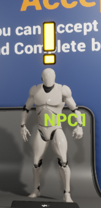  |
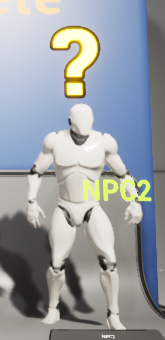 |
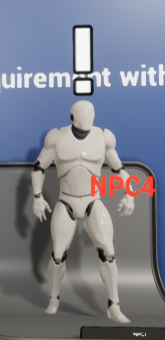 
|


-----------------------
User Guide: How to define QuestRequirement
-----------------------

QuestRequirement is defined using Blueprint that can encapsulate any gameplay logics for Quest Completion test.

1. Create Blueprint inheritted from HorizonQuestRequirement. 

2. Override BP_CheckRequirement and Implement Check Logic: Here we check if flag count large than expected amount that defined in RequirementData.

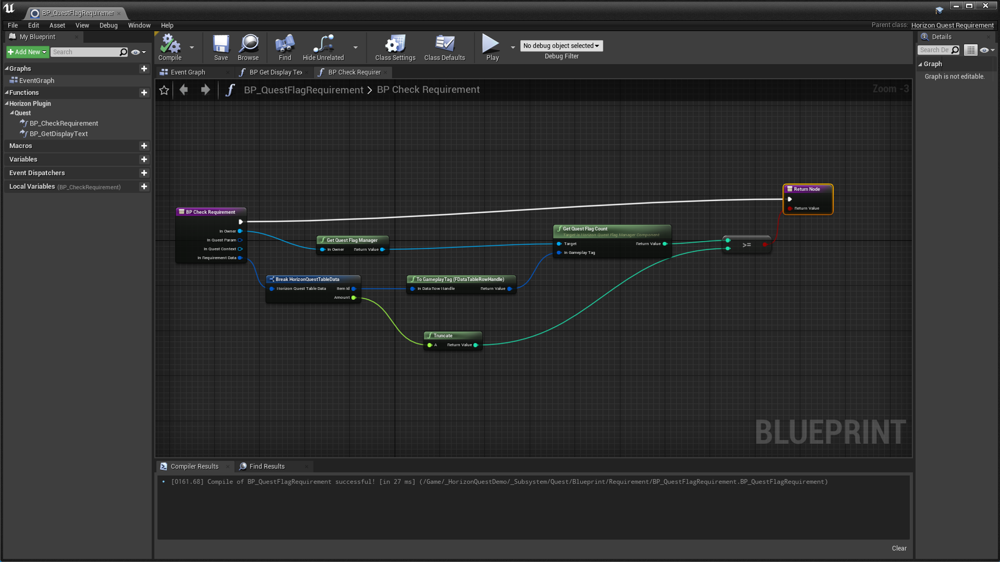  

3. Assign Requirement and RequirementData to Quest defined in Quest DataTable: Here we Set CompleteRequirement will check if Flag_SQ002_Step1_1 count larger than 5.

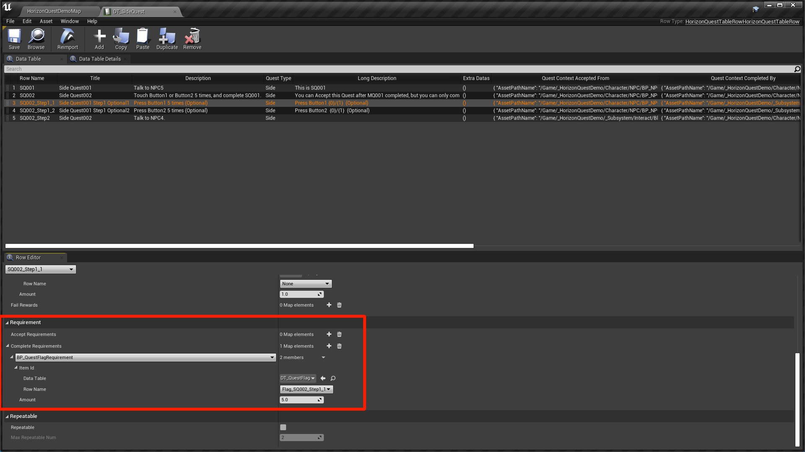 


Here has two types of QuestRequirement:

1. AcceptRequirements: A Quest should pass all requirements assigned in DataTable before the quest can be accepted.  

2. CompleteRequirements: A Quest should pass all requirements assigned in DataTable before the quest can be completed.  


-----------------------
User Guide: How to define QuestReward
-----------------------

QuestReward is defined using Blueprint that can encapsulate any quest reward logics.

1. Create Blueprint inheritted from HorizonQuestReward. 

2. Override BP_AcceptReward and Implement Accept Logic: Here we add player score by the amount that defined in RewardData.  

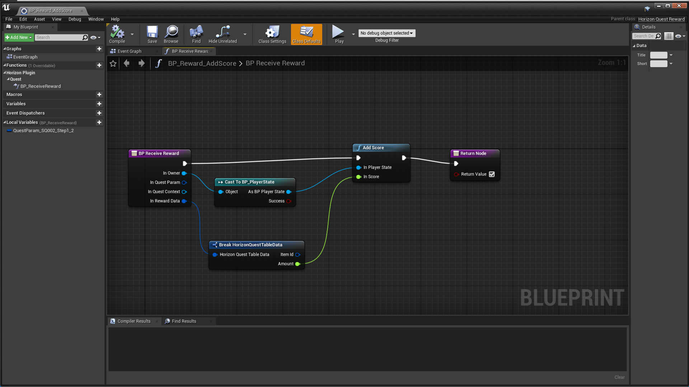  

3. Assign Reward and RewardData to Quest defined in Quest DataTable: Here we Add Score 1 when Quest Accepted and add score 100 when Quest success.  

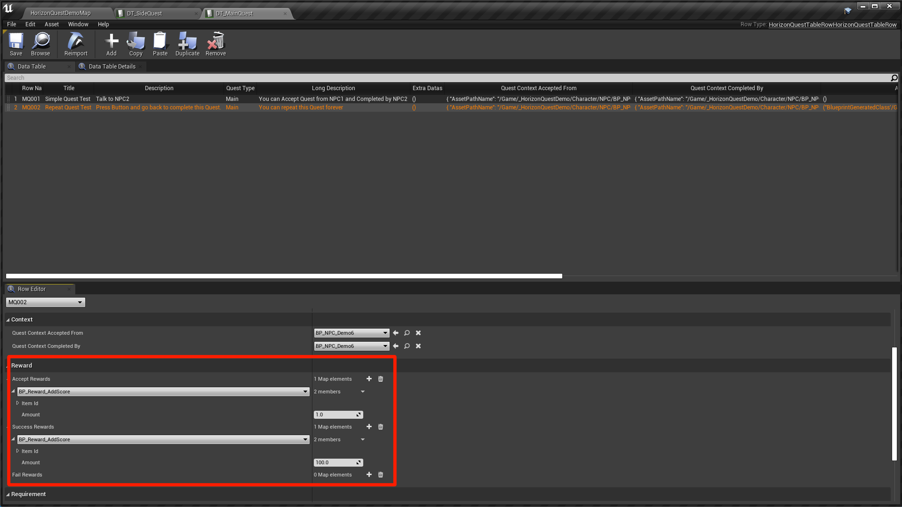 

Here has three types of QuestReward:

1. Quest Accepted: You can give player critical items, for example, a key to open dungeon boss's door.  

2. Quest Completed with Success State.  

3. Quest Completed with Failed State: You can give player any punishment here.  

-----------------------
User Guide: QuestContext
-----------------------

QuestContext is used for Check/Querying if a Quest can be Accept/Completed, Your UObject should implement IHorizonQuestContextInterface in order to be used as QuestContext.

Currently Plugin has two types of QuestContext you can assign to Quests in Quest DataTable:

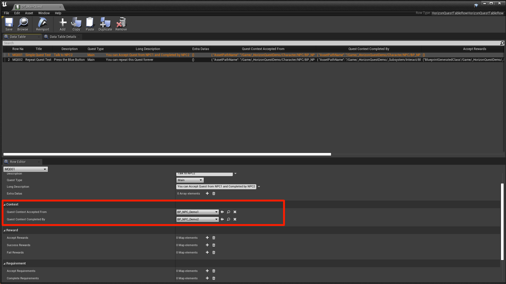 

1. QuestContext_AcceptFrom:  MQ001 can be Accepted from BP_NPC_Demo1, when you trying to Accept the Quest using QuestManager, you should pass BP_NPC_Demo1.  

2. QuestContext_CompletedBy: MQ001 can be Completed by BP_NPC_Demo2, when you trying to Complete the Quest using QuestManager, you should pass BP_NPC_Demo2.  


-----------------------
User Guide: QuestManager
-----------------------

QuestManager is used to store and manipulate player's Quest, 
we can retrive current acceptable/completable quest using given QuestContext, or query a specific quest's state.

It also support Serialization, so we can Save/Load player's quest progress using GetArchiveData/SetArchiveData with [Unreal SaveGame system](https://docs.unrealengine.com/4.26/en-US/InteractiveExperiences/SaveGame/).


-----------------------
User Guide: FlagManager
-----------------------

You can see FlagManager as help or simpler version of Quest System.    

FlagManager didn't have any dependency check, it simply keep record of GameplayTag's trigger count.

The design goal of FlagManager is to help user design complex Quest Requirement, for example, if player need to slay 5 Goblins in order to pass the quest, you can keep the count in the FlagManager and check the count in Requirement to see if player can pass the Quest.

Check here to see how to implement FlagManager:/Game/_HorizonQuestDemo/_Subsystem/Quest/Blueprint/Requirement/BP_QuestFlagRequirement

 


-----------------------
User Guide: Using QuestManager and FlagManager
-----------------------

The best place to put HorizonQuestManager and HorizonQuestFlagManager Component is PlayerState, but if you need to share Quest progress between other players, put the Components in GameState is another choice. 

In order to Accept/Complete a Quest, it should pass all Prerequisite and Precondition check: Quest Progressing checks, Dependency checks, Requirement checks, and QuestContext checks.


-----------------------
User Guide: QuestStep
-----------------------

QuestStep is just another QuestGraph that can assign to every QuestNode, which means you can recursively defined QuestStep for each QuestNode.
We usually didn't want to design a Quest with too much step depth, most quest system I know only support one depth step, but it is depend on game design, this plugin didn't limit depth of QuestStep.

Another hint about QuestStep is you may want to auto accept QuestStep when a Quest begin and start next step when previous step completed.
This plugin support such use case by following two flags in each QuestNode:

1. AutoAcceptQuestStepOnQuestAccepted: Enabled by default, when a Quest is accepted, it also accept all acceptable steps use given QuestContext.  

2. AutoAcceptNextQuestOnQuestCompleted: Disabled by default, when a Quest is completed, it also accept all acceptable Quests use given QuestContext. You usaually want to enable this in QuestSteps but not in MainQuest.

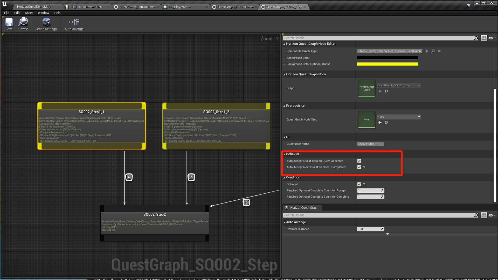 

-----------------------
User Guide: Integrate Quest with Dialogue System
-----------------------

Usually we didn't use QuestSystem alone, it is nessary to provide some extendability so we can integrate with other systems.

This section will show how to extend QuestGraphNode, so we use additional information to integrate with Dialogue System. Here we use [HorizonDialogue Plugin](https://www.unrealengine.com/marketplace/en-US/product/horizondialogue-plugin) as example.

1. Extend QuestGraphNode using C++  

      + In {YourGameProject}.Build.cs, add HorizonQuest to  PublicDependencyModuleNames.

      + Create New C++ that extends from UHorizonQuestGraphNode, ex: UHorizonQuestGameDemoQuestGraphNode

      + Add your Game Specific UPROPERTY, ex: Integrate QuestSystem with HorizonDialogueScene

              
                UCLASS()
                class HORIZONQUESTDEMO_API UHorizonQuestGameDemoQuestGraphNode : public UHorizonQuestGraphNode
                {
                  GENERATED_BODY()
                  
                public:  
              
                      UPROPERTY(EditAnywhere, BlueprintReadOnly, meta = (MetaClass = "HorizonDialogueScene"), Category = "_Game")
                      TArray<FSoftClassPath> PreAcceptDialogueSceneClassPathList;
                  
                      UPROPERTY(EditAnywhere, BlueprintReadOnly, meta = (MetaClass = "HorizonDialogueScene"), Category = "_Game")
                      TArray<FSoftClassPath> InprogressDialogueSceneClassPathList;
                  
                      UPROPERTY(EditAnywhere, BlueprintReadOnly, meta = (MetaClass = "HorizonDialogueScene"), Category = "_Game")
                      TArray<FSoftClassPath> AcceptFrom_InprogressDialogueSceneClassPathList;
                  
                      UPROPERTY(EditAnywhere, BlueprintReadOnly, meta = (MetaClass = "HorizonDialogueScene"), Category = "_Game")
                      TArray<FSoftClassPath> CompleteBy_InprogressDialogueSceneClassPathList;
                  
                      UPROPERTY(EditAnywhere, BlueprintReadOnly, meta = (MetaClass = "HorizonDialogueScene"), Category = "_Game")
                      TArray<FSoftClassPath> PreCompleteDialogueSceneClassPathList;

                      UPROPERTY(EditAnywhere, BlueprintReadOnly, meta = (MetaClass = "HorizonDialogueScene"), Category = "_Game")
                      TArray<FSoftClassPath> AcceptedDialogueSceneClassPathList;

                      UPROPERTY(EditAnywhere, BlueprintReadOnly, meta = (MetaClass = "HorizonDialogueScene"), Category = "_Game")
                      TArray<FSoftClassPath> CompletedDialogueSceneClassPathList;
                  
                };

      + In QuestGraph, change NodeClass to UHorizonQuestGameDemoQuestGraphNode you just created.

      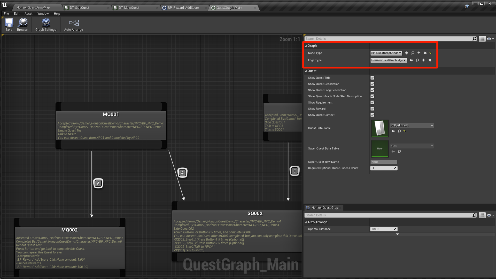 

      + Now you can edit UPROPERTY in QuestGraph.

      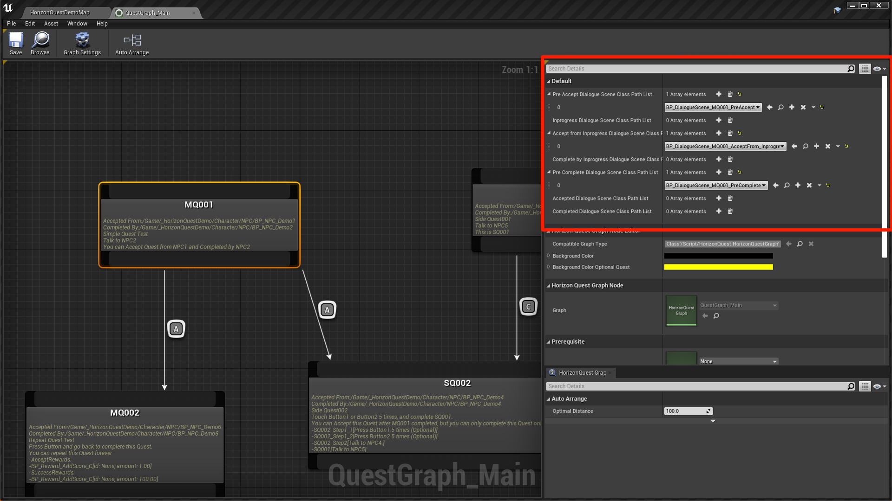 


      + Enqueue Dialogue in OnInteractStarted or in QuestManager's callbacks: OnAcceptQuestEvent, OnCompleteQuest, etc.

      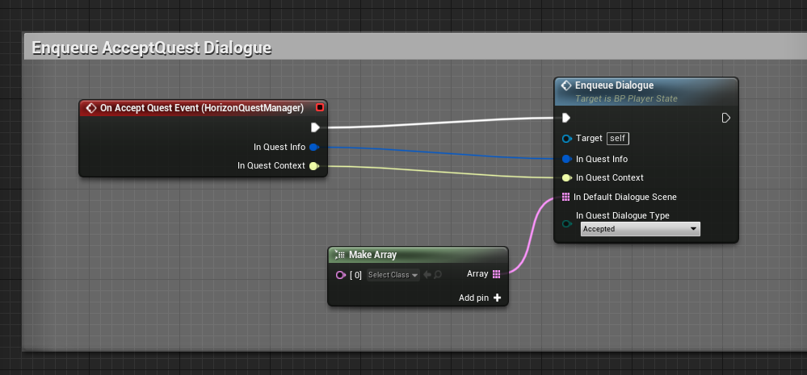 

2. Extend QuestGraphNode using Blueprint

      + The process is similar with C++ version, instead of create C++ class, you only need to create new BP type that extend from HorizonQuestGraphNode and change NodeClass in QuestGraph.

      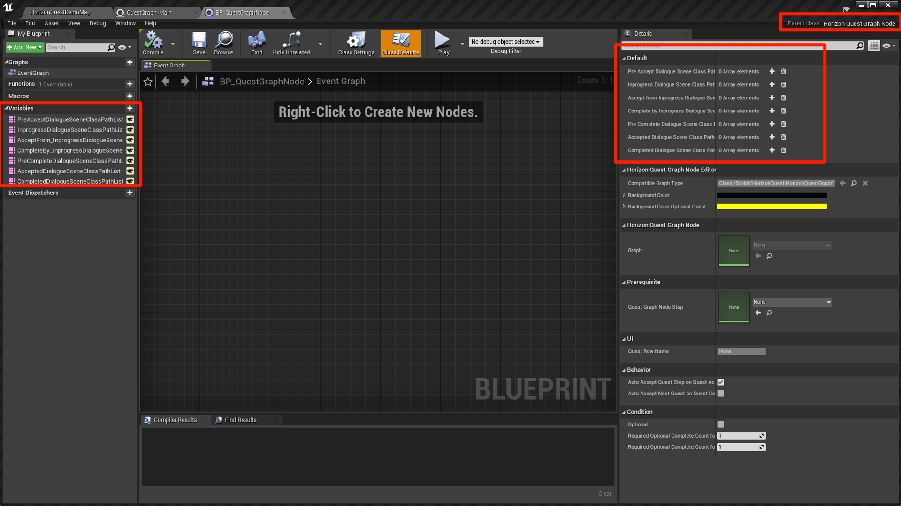 


-----------------------
User Guide: Listen/Dedicated Server support
-----------------------

This plugin is designed to use with network game in mind, but it didn't worked out of box, since it is very difficult to handle all use case without knowing project design. You can check this demo game to see how to make your own games with this plugin, it trying to implement minimum required RPC functions using Blueprint for demo purpose

Here is some tips about how to use plugin with network games.

1. First, you will need to ensure Replicates property is enabled in HorizonQuestManagerComponent and HorizonQuestFlagManagerComponent.

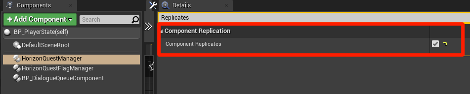 

2. In Widget Blueprint binding and refresh your UI in NetworkReplicated callback.

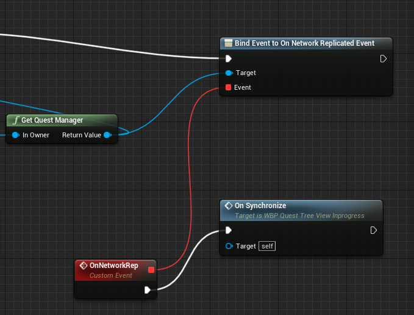 

3. If you put the Components in GameState in order to share Quests between players, you will need to send Accept/Complete Quest RPCs to Server from PlayerController or PlayerState, or you will failed to send RPC directly inside GameState, since client didn't have connect ActorChannel to GameState.

Defined Accept/Complete Quest RPC functions in PlayerController:

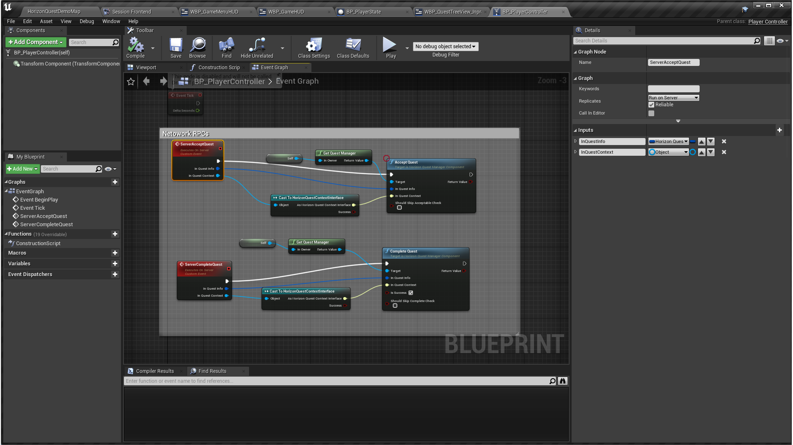


Call Accept/Complete Quest RPC Function from your WBP, it will call Accept/Complete Quest in Server.

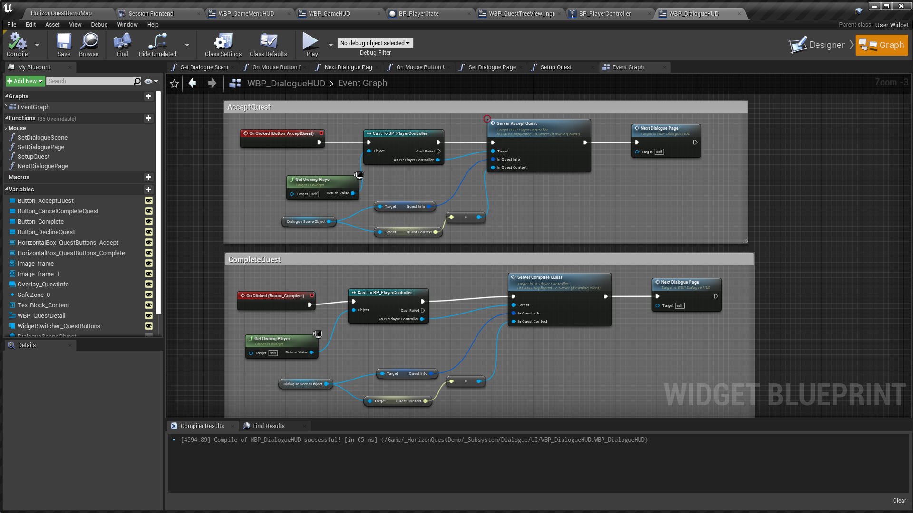


4. You can try to eliminate UI delay caused by network replication callback using client prediction technique: Calling Accept/Complete locally before sending ServerRPC. 


-----------------------
User Guide: Enable Fast TArray Replication(FTR)
-----------------------

[Fast TArray Replication](https://docs.unrealengine.com/en-US/API/Runtime/Engine/Engine/FNetFastTArrayBaseState/) is the feature that are recommanded officially for optimize TArray replication in network games. Althought this plugin implement the feature, but it didn't enbled by default for following reasons:

1. Using this feature without knowing how it works is dangerous.
2. Not all game need it. For some games, it may not have obvious advantage, but introduce some usage limitation.

It is not easy to document the best practice when the feature enabled, but here are some tips:

1. Don't do client side prediction when you trying to AcceptQuest/DropQuest. 
2. QuestTrigger that may AcceptQuest/DropQuest should not run in client.  

For example, you will want to do something like this:  

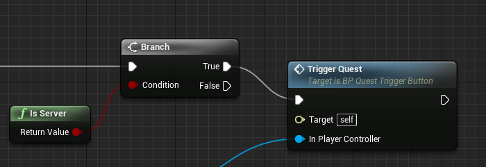

Since FTR will aggressively optimize TArray and only replicated back array items it changed in server,
AcceptQuest/DropQuest will treat client prediction changes and server changes as different array item, 
and you will get different array size in client and server, which is not we expected. 
Without FTR, we are free from the bugs caused by this use case.

To enable this feature, you will need to recompile plugin by copy the plugin from {UNREAL_ENGINE_ROOT}/Engine/Plugins/Marketplace/HorizonQuest to {PROJECT_ROOT}/Plugins, 
and add C++ definition to all of your build targets, {PROJECT_NAME}.Target.cs and {PROJECT_NAME}Editor.Target.cs:
```
bOverrideBuildEnvironment = true;
GlobalDefinitions.Add("HORIZON_PLUGIN_ENABLE_FAST_TARRAY_REPLICATION=1");
```

You can check HorizonQuestGraphDataContainer and HorizonQuestFlagDataContainer to see how it implemented.

-----------------------
Technical Details
-----------------------

The goal of this plugin is to provide a general purpose Quest System that can support non-linear story telling. 

Although this plugin didn't implement a Dialogue System with it, but it was designed in mind with flexibility for customization with game project, so can be integrated with any other systems you like. 

Features:

1. QuestGraph systems that can define non-linear depencency of each Quests.

2. Support Accept/Complete QuestRequirement and QuestReward.

3. Callbacks that can be used to customize your games. ex: OnAcceptQuestEvent, OnCompleteQuestEvent, OnAcceptQuestRewardEvent, OnQuestStateChangedEvent, OnDropQuestEvent
  
4. Additional QuestFlagSystem that help designer record any gameplay flag that can be used with QuestRequirement to check if a Quest can be Accepted/Completed.

5. QuestTreeView Menu Widgets and Debug UI: for showing Quests with  UMG Widgets.

Code Modules:

HorizonQuest (Runtime)
HorizonQuestEditor (Editor)
HorizonQuestFlag (Runtime)

Network Replicated: True  

Supported Development Platforms: Win64, Mac, Linux  

Supported Target Build Platforms: All Platforms  

Tested Platform: Win64  

Documentation and Example: https://github.com/dorgonman/HorizonQuestDemo

[DemoVideo](https://youtu.be/ju3tL1lv7lU)  
[QuickStartVideo](https://youtu.be/mANMYY476mM)

-----------------------
What does your plugin do/What is the intent of your plugin
-----------------------  

The goal of this plugin is to provide a General Quest Graph system for Games.

-----------------------
Contact and Support
-----------------------

email: dorgonman@hotmail.com

-----------------------
 Version History
-----------------------

*5.4.1

* [BugFix] Fix Quest DataTable can't be assigned

* [Refactor] RawPointer to TObjectPtr


*5.4.0

      Update to 5.4.0

*5.2.1

* [BugFix] Fix Quest DataTable can't be assigned

*5.2.0

* [New][Network] SetIsReplicatedByDefault(true) for Manager and FlagManager Component

*5.1.0

* [New][QuestManagerComponent] Deprecate ClearQuestGraphSaveGameData, use ClearArchiveData instead

*5.0.1 

* [BugFix] RefreshQuestListViewByQuestList not work as expect and possible crash

* [BugFix] UE5 Compile Warning


*5.0.0

* [BugFix][DataTable] Fix HorizonQuestDataTableRowHandle operator override wrong type

* [BugFix] Fix build machine compile error

* [Refactor][QuestManager] SetArchiveData

* [BugFix] Skip InQuestTypeTagFilter check if it is empty

* [New][HorizonQuestTableRow] Implement QuestTypeTag


*4.27.2  

      NEW: Implement Fast Array Replication and redesign SaveGameData

*4.27.0  

        NEW: First Version including core features.  